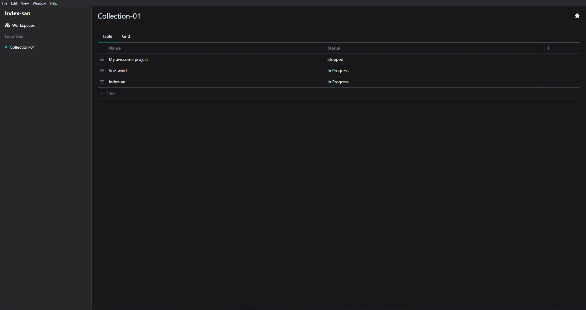

<div align="center">

# Index-san

A CRUD maker based in filesystem

(under development)

</div>




## Setup

Install dependencies

```
npm install -ws 
```

Run electron app

```
npm -w desktop run dev
```


## About

The idea is have something like notion but using files and folders instead of an usual database.

This is useful because you can link your notes/tasks to things that normally are not possible.

Examples:

- linking a `project.psd` file directly to a project or task
- linking a `video-raw.mp4` to a task in your Kanban board
- linking an important file like `private-file.txt` to a project without worrying about data leak

This way it will be possible to use only one app to organize all files, notes, tasks and without needing any work around or worrying about file-size upload limit.

For access to app from multiple devices you will be able to do it syncing the folder of a workspace to Cloud service like [Google Drive](https://www.google.com/intl/pt-BR/drive/) or [One drive](https://www.microsoft.com/pt-br/microsoft-365/onedrive/online-cloud-storage).

All configuration and data of a workspace are saved inside its folder so you can freely move him as you wish.


## How it works?

The first entity you need to know is a `Workspace`, this is a folder in your computer that will save all options and files of the app.

Then we have an `DirectoryEntry` that is a simple representation of files and folders inside the workspace.

And `Collection` that is Data source of files and folder, this is equivalent to an database in notion.

And finally an `Item`, as the name say is an item of a collection and is equivalent to note inside a database in notion

## Current status

Well the app still is missing important features but we already have a basic MVP that can create collections, items and directory-entries.

One main feature missing to notice is the markdown editor of an item, where you will be able to create table, lists, checkboxes and liked-collections(linked-database notion) using markdown syntax

This feature is still in elaboration but will be added in future updates

Also you will notice that the interface is not very polish yet. this is because now I focusing mainly in elaborate and create the features instead of beauty, but of course the app will have a proper design later.

## Project structure

The project use `SOLID` pattern to build the `core` of the system, and the client is an electron app.

There are divider in the ./packages/core and ./packages/desktop folder