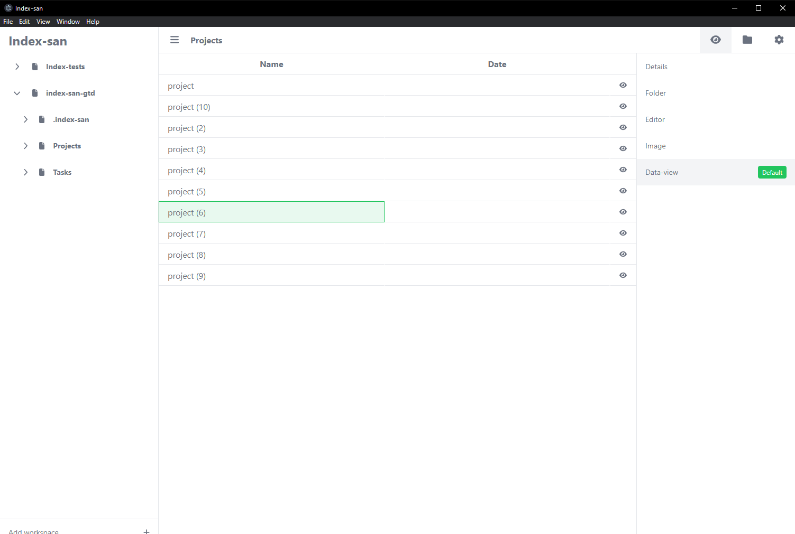

<div align="center">

# Index-san
A Filesystem based notes app

</div>



The project is very in early development so basic features do not exists yet

## Requirements

This is a electron app so make sure your environment is ready to open this type of app

## Usage

Clone the repository

```
git clone https://github.com/sidekick-coder/index-san.git
```

Install the dependencies
```
npm install
```

Run the app
```
npm run dev
```

