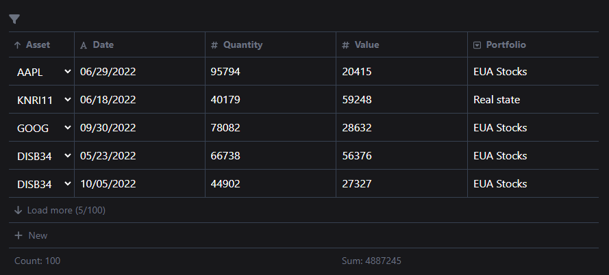
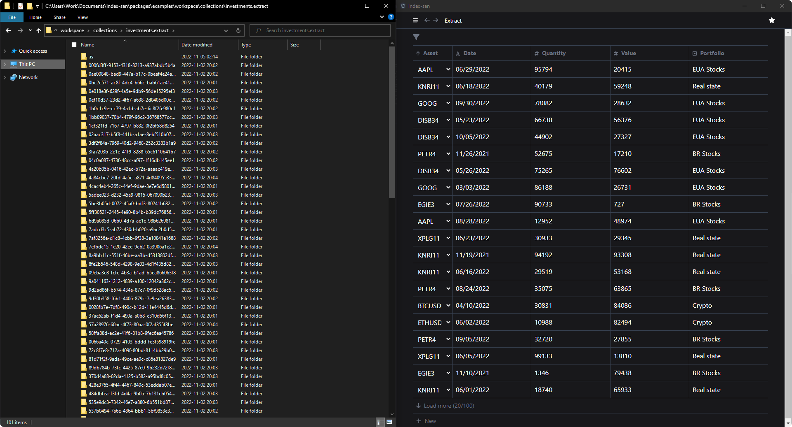

<div align="center">

# Index-san


Notes app & files management app (under development)

[Downloads](https://github.com/sidekick-coder/index-san/releases)

</div>

## About

The idea is have something like notion but using files and folders instead of an usual database.

This is useful because you can link your notes/tasks to things that normally are not possible like PSD and MP4 files.

## Setup

Install dependencies

```bash
npm install // install root dependencies

npm install -ws // install packages dependencies

npm run dev // Run electron app
```


## Table view




## Charts view


## Data saved locally

